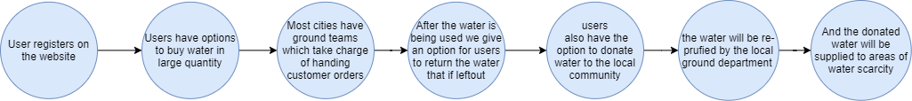

# PURGO

## Contents

1. [Short description](#short-description)
2. [Demo Video](#demo-video)
3. [The Architecture](#the-architecture)
4. [Long Description](#long-description)
5. [Project Roadmap](#project-roadmap)
6. [Getting Started](#getting-started)
7. [Live Demo](#live-demo)
8. [Built With](#built-with)
9. [Contributing guidilines](#contributing-guidilines)
10. [Versioning](#versioning)
11. [License](#license)
12. [Versioning](#versioning)
13. [Acknowledgements](#acknowledgements)

## Short Description

### 1. What's the problem?

Part of the World Health Organization's guidance on limiting further spread of COVID-19 is to practice propoer hand washing and ensure sanitation around to limit the spread of virus. Events planned on a large scale observe wastage of water in big amounts. On the other hand, before COVID-19, 2.2 billion people lack safely managed drinking water and 4.2 billion people lack safely managed santation. Post COVID-19, the number are even more. All this encapsultes to scarcity of safely managed water.

### 2. How can technology help?

As responsible citizens, people holding big events can record their event on a GPS enabled application. Waste water shall be collected from the event, sent to purifying units and distrbute it to localities where there is scarcity of water.

### 3. The idea

Scarcity of water poses risk of a lot of other diseases too other than COVID-19 . As COVID-19 has become the new normal, availability of safely managed drinking water is a priority now for people to keep themselves healthy

## Demo Video

## The Architecture

1. The user (event holder) shall register the event
2. The GPS enabled app shall record its location
3. Waste water shall be collected from the events
4. GPS enabled application shall list water purifying units
5. GPS enabled application shall list down communities having scarcity of water
6. Safely managed water shall be transported to communties having scarcity of water

## Long Description

To encourage optimal water choices by consumers and to incentivize water sustainability, we propose devising and implementing an API for big sources of unused water and its dissemination. With an API, you could have a centralized way to:

1. Query geolocations of sustainable water sources
2. Water purifying units
3. Access list of areas where there is shortage of water as compared to other areas
4. Explore educational tools to support water sustainability and clean water access
5. Enable transparent water usage, cleanliness results, and site-to-site comparison
6. Access plain language case studies. We are initially focusing on the development of a starter kit that will enable these channels to be developed to their fullest potential.
   Expected Solutions
7. The user or community leader accesses a Clean Water Insights Dashboard.
8. The insights dashboard requests the Clean Water API for data that the user wants (including queries made on a chatbot).
9. The user can converse with a chatbot to get necessary information, and the insights dashboard can act as an orchestration application for the chatbot.
10. The Clean Water API component retrieves the required data from various sources and aggregates them as necessary.
11. A machine learning module uses the data sources as a corpus to build a recommendation model and host that model.
12. The Clean Water Insights Dashboard can get recommendation and prediction information from a recommendation engine.

## Project Roadmap



## Getting Started
Please follow the following to run the application

1. Clone the repository to a location of your Desktop by using git comand
 ```sh
cd ~/Desktop/
git clone https://github.com/irsayvid/nirvana.git
```
2. Go to project folder by pressing following commands in terminal or shell
```sh
cd ~/Desktop
cd nirvana
```
3. Open the project in Visual Studio or any editor of your choice

4. Install all the dependencies using the following commands in both app and in directory client
```sh 
npm install
cd client 
npm install
```
5.run application by running either of the following two commands
```sh
npm start
```
```sh
yarn start
``` 

6. The web app opens in **https://localhost:3000** in your browser

## Live Demo

## Built With
- React
- Firebase
- IBM Cloud Functions
- IBM API Gateway
- IBM Watson

## Contributing guidilines

## Versioning

## Authors

- [Agnihotri Shubhra](https://github.com/agnihotrishubhra)
- [Anshuman Sandhibigraha](https://github.com/anshusandhi6)
- [Rupesh Darimisetti](https://github.com/Rupesh-Darimisetti)
- [Divya Sri Darimisetti](https://github.com/irsayvid)
- [Sairaj Chouhan](https://github.com/sairaj2119)

## License

[Apache License 2.0](./LICENSE)

## Acknowledgements
